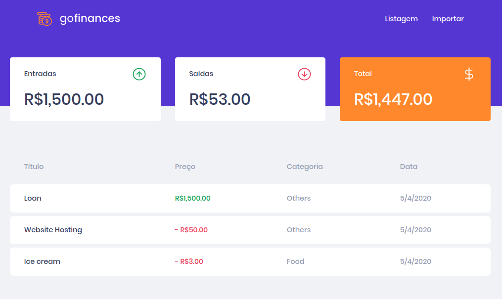

# Desafio 07 - GoFinances Web

Solução do desafio 07 do curso [GoStack](https://rocketseat.com.br/gostack) (turma11) da Rocketseat.

Instruções do desafio disponíveis no arquivo [instructions.md](https://github.com/jobsonita/rocketseat-bootcamp-nivel03-desafio01/blob/master/instructions.md).

Este desafio deve ser executado em conjunto com o desafio 06. Minha solução desse desafio está disponível em: [jobsonita/rocketseat-bootcamp-nivel02-desafio02](https://github.com/jobsonita/rocketseat-bootcamp-nivel02-desafio02). É necessário adicionar a biblioteca cors ao projeto e adicionar o respectivo middleware ao servidor express. Outras alterações necessárias podem ser encontradas [neste commit](https://github.com/jobsonita/rocketseat-bootcamp-nivel02-desafio02/commit/a8fe1d9cd7b93fdad085c89156c91a3d1eacb4d8). Execute o checkout da branch "desafio07" para a versão pronta com as alterações listadas acima.

